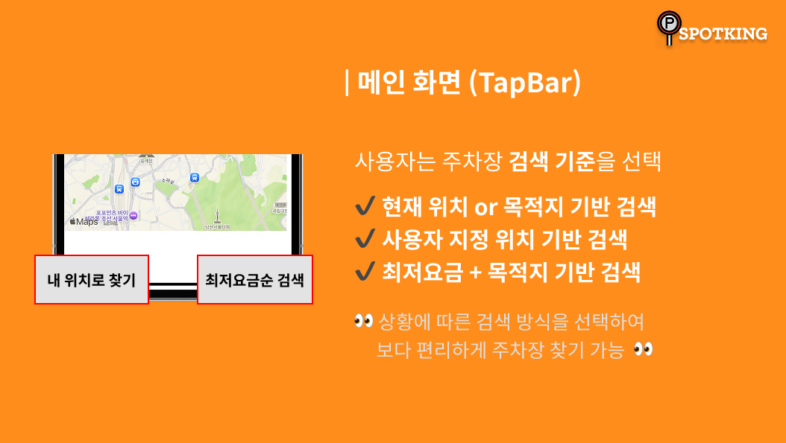

# 🚘 SPOTKING - 공영주차장 실시간 빈자리 찾기 도우미

  

## 📝 프로젝트 소개

 **“실시간 공영주차장 찾기 도우미 SPOTKING”** 은 사용자의 현재 위치 기반으로 주변 공영주차장의 실시간 빈자리 현황을 조회할 수 있는 iOS 전용 어플리케이션입니다.
공공데이터 포털의 공영주차장 정보 API를 활용하여, 실시간으로 주차 가능 여부와 주차장 정보를 제공하며,
지도 기반 UI를 통해 사용자가 빠르게 주차할 수 있는 장소를 확인할 수 있도록 도와줍니다.

## 📱 주요 기능

  
  

  
  

  
  

  
  

---

## 🧪 성능 개선 및 UX 개선

- **주소 → 마커 처리 최적화**
  기존에는 지도에 마커를 하나씩 즉시 추가했지만,

  모든 주소를 먼저 CLGeocoder로 비동기 변환 → 배열 저장 → 일괄 렌더링 방식으로 전환하여

  🔹 **로딩 시간이 약 1.2초 단축**, 앱 성능이 눈에 띄게 개선되었습니다.
 

- **UX 개선 - 모달 구조 리팩토링**
  사용자가 마커를 누를 때마다 모달이 중첩되어 UX가 복잡해졌습니다.

  이를 단일 디테일 뷰 전환 방식으로 리팩토링하여

  🔹 **가독성이 향상되고 UI 흐름이 간결**해졌습니다.

---

## 🛠️ 기술 스택

| 분야          | 기술 및 도구                          |
|--------------|------------------------------------|
| 플랫폼           | iOS (Swift, Xcode)              |
| UI 개발         |UIKit, Auto Layout                |
| 위치 기반 & 지도  | CoreLocation, CLGeocoder, MapKit |
| 외부 API 연동    | 공공데이터포털 - 공영주차장 실시간 정보 API|
| 협업 도구        | Git, GitHub                        |
